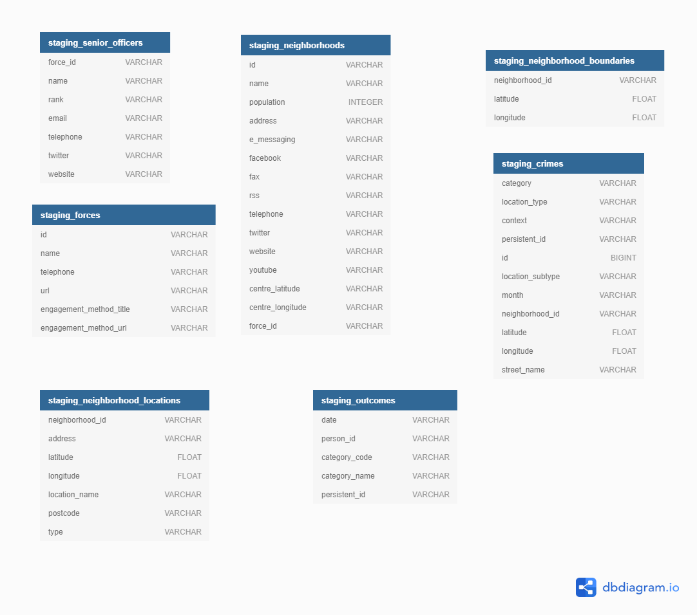
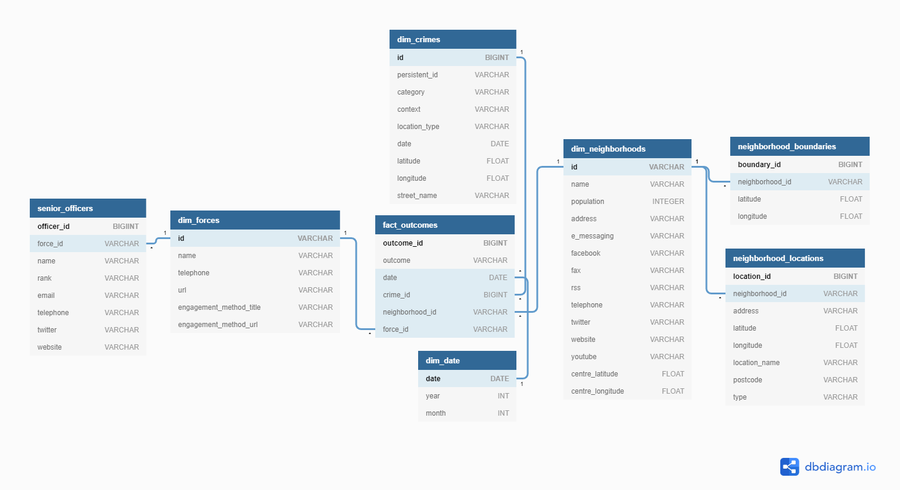
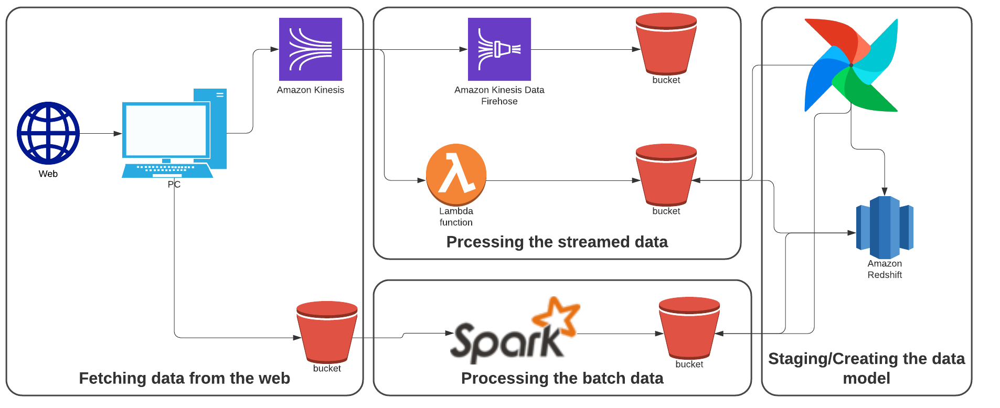
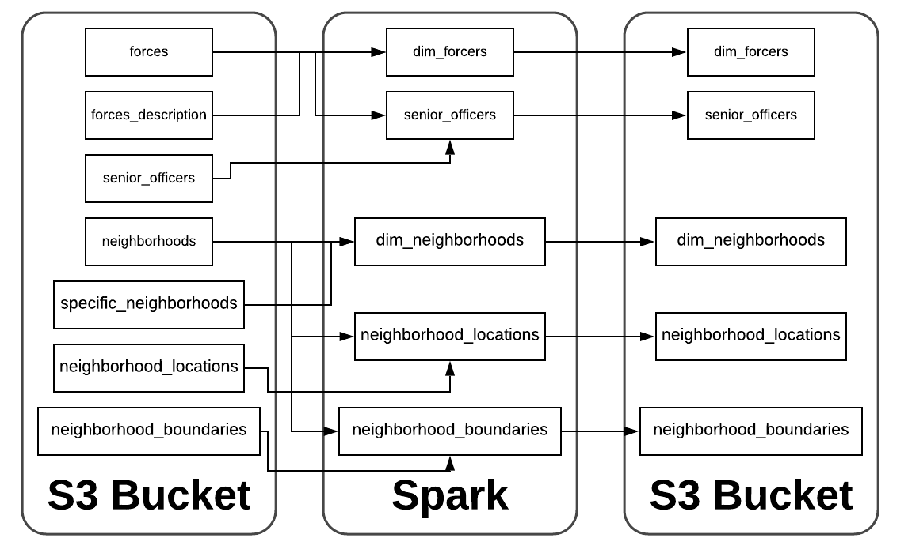
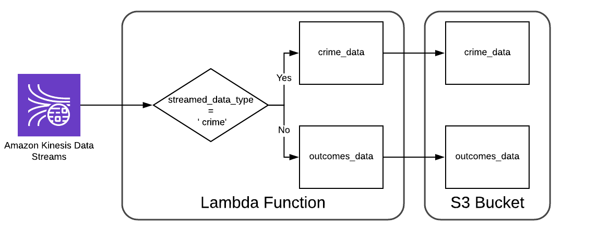
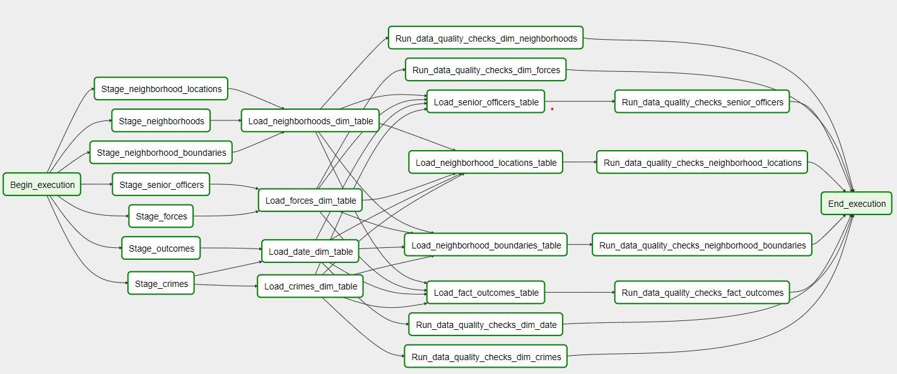

# Udacity Data Engineering Capstone-Project
## Project Description
UK Police has a great dataset that provides open data about police, crimes and outcomes in England, Wales and 
Northern Ireland and is available on [data.police.uk](data.police.uk). We can also filter the data based on regions, cities, neighborhoods, 
coordinates, officer names, crime category etc. inside the United Kingdom. 

The purpose of this project is to the fetch the data about the crimes from the api offered by 
UK Police. ETL pipeline is then built which extracts the data from the fetched data,
stages the data in Redshift and transforms the data into a set of dimensional tables. The database and ETL pipeline will
then be tested by running queries.

Further documentation about the API can be found [here](https://data.police.uk/docs/)

---
## Data Sources
* **Forces**: A list of all the police forces available via the API except the British Transport Police, which is 
excluded from the list returned. Further documentation of the data can be found 
[here](https://data.police.uk/docs/method/forces/)
* **Specific Force**: A list of forces and the description of the forces available via the API. Further documentation
of the data can be found [here](https://data.police.uk/docs/method/force/)
* **Senior Officers**: A list of all the senior officers of the specific force availabe via the API. Its documentation can
be found [here](https://data.police.uk/docs/method/senior-officers/)
* **Neighborhoods**: A list of all the neighborhoods for a force available via the API. Further the documentation of 
the data can be found [here](https://data.police.uk/docs/method/neighbourhoods/)
* **Specific neighbourhood**: A list of neighborhoods and the descriptions of the neighborhoods available via the API. 
Further documentation of the data can be found [here](https://data.police.uk/docs/method/neighbourhood/)
* **Neighbourhood boundary**: A list of latitude/longitude pairs that make up the boundary of a neighbourhood 
available via the API. Further documentation of the data can be found
 [here](https://data.police.uk/docs/method/neighbourhood-boundary/)
* **Street-level crimes**: Crimes at street-level; either within a 1 mile radius of a single point,
 or within a custom area available via the API. Further documentation of the data can be found
 [here](https://data.police.uk/docs/method/crime-street/)
* **Outcomes for a specific crime**: Returns the outcomes (case history) for the specified crime. Crime ID is 
64-character identifier, as returned by other API methods. Further documentation can be found 
[here](https://data.police.uk/docs/method/outcomes-for-crime/)

---
## Exploration and Assessing the data
The different calls mainly forces, neighborhood and crimes related requests from the API are explored. Following are the results obtained after the exploration.
### Forces related Exploration
The forces related responses from the API will be explored namely:
1. Forces
2. Specific forces
3. Senior Officers

The structure of the data retrieved from these calls is as follows:

1. **Forces**
    * **id**: Unique force identifier
    * **name**: Force name
2. **Specific forces**:
    * **description**: Description of the force
    * **url**: Force website URL
    * **engagement-methods**: Ways to keep informed.
        * **url**: Method website URL
        * **description**: Method description
        * **title**: Method title
    * **telephone**: Force telephone number
    * **id**: Unique Force identifier
    * **name**: Force name
3. **Senior Officers**:
    * **bio**: Senior officer biography (if available)
    * **contact_details** : Contact details for the senior officer
        * **twitter**: Twitter profile URL
        * **telephone**: Telephone number
        * **website**: Website address
        * **email**: Email address
    * **name**: Name of the person
    * **rank**: Force rank

As it can be seen from the above exploration some of the fields in the forces related records are nested. During ETL they'll be unnested.
### Neighborhood Related Exploration
The neighborhood related responses from the API will be explored namely:
1. Neighborhood
2. Specific neighborhood
3. Neighborhood boundary


1. **Neighborhood**:
    * **id**: Police force specific team identifier.
    * **name**: Name for the neighbourhood

2. **Specific neighborhood**:
    * **url_force**: URL for the neighbourhood on the Force's website
    * **contact_details**: Ways to get in touch with the neighbourhood officers
        * **twitter**: Twitter profile URL
        * **facebook**: Facebook profile URL 
        * **telephone**: Telephone number 
        * **email**: Email address
    * **name**: Name of the neighbourhood
    * **welcome_message**: An introduction message for the neighbourhood
    * **links**
        * **url**: URL
        * **description**: Description of the link (if available)
        * **title**: Title of the link
    * **centre**: Centre point locator for the neighbourhood.
        * **latitude**: Centre point latitude
        * **longitude**: Centre point longitude
    * **locations**: Any associated locations with the neighbourhood, e.g. police stations
        * **name**: Name (if available)
        * **longitude**: Location longitude
        * **latitude**: Location latitude
        * **postcode**: Postcode of the location
        * **address**: Location address
        * **type**: Type of location, e.g. 'station' (police station)
        * **description**: Description of the location
    * **population**: Population of the neighbourhood
    * **id**: Police force specific team identifier. This identifier is not unique and may also be used by a different force.
    * **description**: Description (if available)
3. **Neighborhood Boundary**:
    * **latitude**
    * **longitude**
    
As it can be seen from the above exploration some of the fields in  the neighborhood related records are nested. During ETL they'll be unnested.
### Crime Related
The crime related responses from the API will be explored namely:
1. Street level crimes
2. Outcomes for a specific crime


1. **Street level crimes**:
    * **category**: Category of the crime
    * **persistent_id**: 64-character unique identifier for that crime.
    * **month**: Month of the crime
    * **location**: Approximate location of the incident
        * **latitude**: Latitude of the location
        * **longitude**: Longitude of the location
        * **street**: The approximate street the crime occurred
            * **id**: Unique identifier for the street
            * **name**: Name of the location
    * **context**: Extra information about the crime
    * **id**: ID of the crime. This ID only relates to the API, it is NOT a police identifier
    * **location_type**: The type of the location. Either Force or BTP: Force indicates a normal police force location; BTP indicates a British Transport Police location. BTP locations fall within normal police force boundaries.
    * **location_subtype**: For BTP locations, the type of location at which this crime was recorded
    * **outcome_status**: The category and date of the latest recorded outcome for the crime
        * **category**: Category of the outcome
        * **date**: Date of the outcome
        
2. **Outcomes for a specific crime**
The call to this API returns the outcomes (case history) for the specified crime. 
After reading the documentation it can be seen that to get the information on the outcome for a specific crime `Crime ID (persistent id)` which is returned by the street level crime is needed.

    * **outcomes**: A list of categories and dates of each outcome
        * **category**: Category of the outcome
            * **code**: Internal code
            * **name**: Human-readable name
        * **date**: Date of the outcome
        * **person_id**: An identifier for the suspect/offender, where available.
    * **crime**: Crime information
        * **category**: Category of the crime
        * **location_type**: The type of the location. Either Force or BTP: Force indicates a normal police force location; BTP indicates a British Transport Police location. BTP locations fall within normal police force boundaries.
        * **persistent_id**: 64-character unique identifier for that crime.
        * **month**: Month of the crime
        * **location**: Approximate location of the incident
            * **latitude**: Latitude of the location
            * **longitude**: Longitude of the location
            * **street**: The approximate street the crime occurred
                * **id**: Unique identifier for the street
                * **name**: Name of the location
        * **context**: Extra information about the crime
        * **id**: ID of the crime. This ID only relates to the API, it is NOT a police identifier

As it can be seen from the above exploration some of the fields in crime related records are nested. During ETL they'll be unnested.

---

## Data Model
### Staging Tables


### Schema



### Explanation
The above Entity-Relationship Diagram shows the data model used. Seven staging tables are created as shown in the figure. These tables are used for staging the `JSON` data from the `S3` bucket. The tables in the schema are then copied from the staging tables. The fact table in the shcema represents the outcome of the specific crime.


## Data Pipeline Explained

The whole data pipeline consists of the following parts:

1. **Fetching data from the web**: The data is fetched from the web `API` in local computer. The `neighborhood` and `forces` related data are fetched and stored in the local computer and the data is then stored in the `S3` bucket. The `crime` related data is then streamed into Kinesis data stream.  
2. **Processing the batch data**: The data that was directly put into the S3 bucket is then processed by the Spark cluster and is then stored in the S3 bucket. 
3. **Prcessing the streamed data**: Lambda architecture is used here. The data which is streamed into Kinesis data stream is then pulled by Kinesis Firehose which then stores the exact copy to the S3 bucket. Streamed data is also processed by using Amazon Lambda Function and the data is then stored into S3 bucket.
4. **Staging/Creating the data models**: Airflow is used for schedule/stage the data from bucket to the database in Amazon Redshift. Further ETL is then performed on the staged data and the data is loaded into the schema. As the data is real time data airflow schedules the job on hourly basis.

---

## ETL pipeline Explained
Here ETL pipeline is run via spark, lambda function and airflow separately. So let's look at them:

### ETL via Spark


As it can be seen that the data is loaded from the S3 bucket inside spark. All the data is in json format. The data is processed and then written into S3 bucket again.

### ETL via Lambda function


As it can be seen from the above figure that the data which is streamed into kinesis is processed in the lambda function and crime and outcomes data is extracted and then the both of the data is written in S3 bucket.

### ETL via Airflow


The DAG consists of the following stages:

1. The data is pulled from the S3 into the staging tables in Redshift.
2. Data is then loadled into the four dimension tables.
3. The fact tables and other tables are built either by joining or loading directly from the staging tables.
4. The quality checks are run on all the tables.

---

## Execution Instructions
1. Create a new AWS account and download `credentials.csv` and copy `credentials.csv` in the credentials folder.
2. Fill up `resources.cfg` file in the credentials folder according to your requirements.

3. Install all the required python libraries by executing the following command:
    ```bash
    pip install -r requirements.txt
    ```

4. Create all the resources in `AWS` by running the following command in the terminal:
    ```bash
    python create_aws_resources.py
    ```
5. Fetch forces and neighborhood related records from the API and storing the data into `S3 bucket` by entering the following command in the terminal:
    ```bash
    python static_data.py
    ```        
6. Fetch the crime related records from the API and pushing the records into the `Kinesis data stream` by entering the following command in the terminal:
     ```bash       
     python stream_data.py
     ```
7. Perform the ETL using spark by running the following command in the terminal:
     ```bash
     python etl.py
     ```
8. To run airflow DAG you need to create the environment variable in the bash by using the following command:
    ```bash
    export AIRFLOW_HOME=~/airflow
    ```
9. Now run the DAG in the airflow. Note `credentials` folder and its content are needed to run the airflow job and `credentials` folder should be in `~/airflow` directory.

10. After you are done with the pipeline and release the resources. Run the following command in the terminal:
    ```bash
    python release_aws_resources.py
    ```
---
